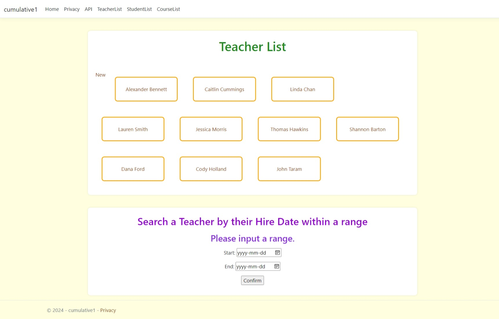
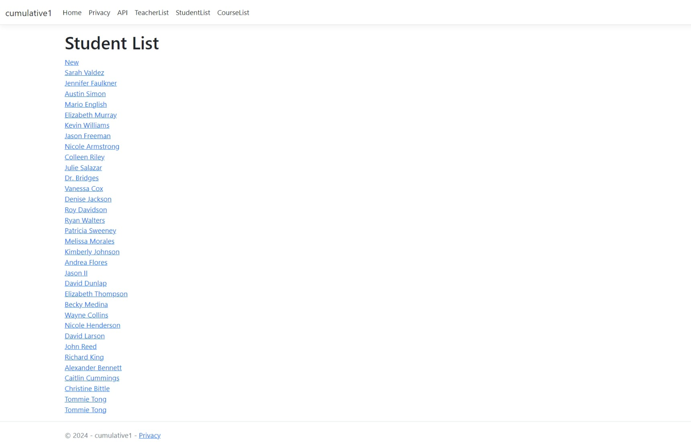
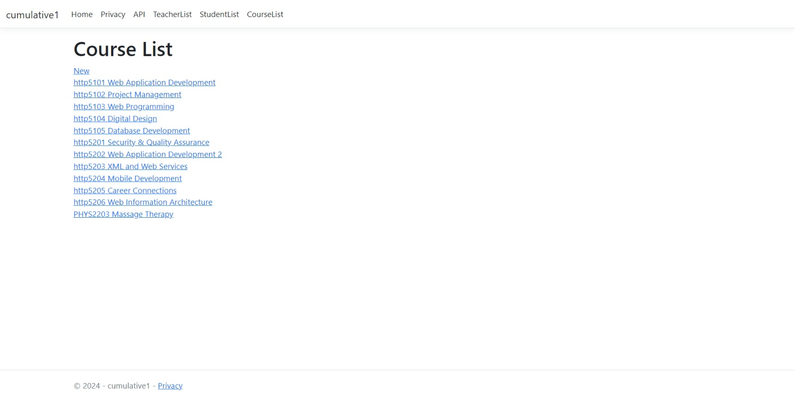

# HTTP5125 Cumulative Project

---

This project connects our server to a MySQL Database with MySql.Data.MySqlClient.

It also shows Add and Delete through an API POST and DELETE request, as well as supporting webpages.

- Models/BlogDbContext.cs

  A class which represents the connection to the database. Be mindful of the connection string fields!

- Program.cs

  Configuration of the application.

## API Controllers

---

- Controllers/TeacherAPIController.cs
  An API Controller which allows us to access and manipulate information about Teachers.

  GET: api/Teacher/ListTeachers -> A list of teachers.

  GET: api/FindTeacher/{id} -> Find a teacher information with the teacher id.

  POST: api/Teacher/AddTeacher -> Add new teacher information.

  DELETE: api/TeacherAPI/DeleteTeacher/{id} -> Delete a teacher with the teacher id.
  

- Controllers/StudentAPIController.cs
  An API Controller which allows us to access and manipulate information about Students.

  GET: api/Student/ListStudents -> A list of students.

  GET: api/FindStudent/{id} -> Find a student information with the student id.

  POST: api/Student/AddStudent -> Add new student information.

  DELETE: api/Student/DeleteStudent/{id} -> Delete a student with the student id.
  

- Controllers/CourseAPIController.cs
  An API Controller which allows us to access and manipulate information about Courses.

  GET: api/Course/ListCourses -> A list of courses.

  GET: api/FindCourse/{id} -> Find a course information with the course id.

  POST: api/Course/AddCourse -> Add new course information.

  DELETE: api/Course/DeleteCourse/{id} -> Delete a course with the course id.
  
